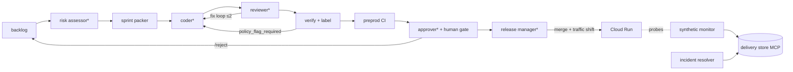

# Architecture

Agentic SDLC governs a fleet of coding agents the way an engineering
manager governs a team: it plans a sprint under a risk budget and a
token budget, verifies claimed risk against actual diffs, gates
approvals through humans, and makes incident-aware release decisions
against a live Cloud Run service.

Core design principle: **thin reasoning agents over a thick
deterministic substrate**. Every component is classified honestly as a
reasoning agent (an LLM decision loop over under-determined judgment)
or a deterministic tool (solver, script, threshold check). Agent labels
are earned by reasoning, not decoration.

## Pipeline

`*` = reasoning agent. Everything else is deterministic.

## Component classification

| Component | Kind | Why |
|---|---|---|
| Risk assessor | reasoning agent (Gemini) | risk/effort judgment is under-determined |
| Dependency graph | deterministic tool | import-graph closure = blast radius |
| Sprint packer | deterministic solver | constraint packing has a right answer |
| Coder | reasoning agent (Claude via LiteLLM) | writes code, owns the fix half of the generator-critic loop |
| Reviewer | reasoning agent (Gemini) | adequacy/scope judgment; different model family than coder to decorrelate failure modes |
| Verify + label | deterministic + thin check | files touched, closure, flag coverage vs claimed risk |
| Preprod CI | deterministic script | build, tagged revision, smoke test |
| Approver | thin reasoning agent + human gate | dossier assembly; decision is human, on the PR (ADR-0005) |
| Release manager | reasoning agent (Gemini) | weighs incidents, closures, confidence windows |
| Synthetic monitor | deterministic prober | threshold check on a sliding window |
| Incident resolver | deterministic tool | hysteresis rule; separate from detection by role |
| Orchestrator | plain Python driver | sequential, inspectable (ADR-0003) |

## The one MCP boundary

The delivery store (`mcp_server/`) is the single shared boundary every
component crosses; it is the only MCP server (ADR-0002). Security
properties live in its tool surface: append-only audit, role-scoped
incident paths (per-caller bearer tokens).

## Knowledge architecture

Knowledge splits by owner (ADR-0001): design invariants (structural,
never injected) · step base prompts (`sdlc-steps/<step>/prompts.md`,
engine-owned, open with immutable core rules) · step policy defaults
(`sdlc-steps/<step>/policy.yaml`; cross-step keys in
`sdlc-steps/policy.yaml`; pipeline flow control in
`sdlc-steps/orchestrator/policy.yaml`) · project overlays mirroring the
same hierarchy (`config/projects/<name>/sdlc-steps/<step>/` —
customised-prompt.md extends prompts, policy.yaml overrides numbers) ·
ADRs (for humans, never injected).

Composition order at invocation:
**base prompts.md → customised-prompt.md → task payload.**

## Extensibility ports (one implementation each)

| Port | Implementation | Documented successor |
|---|---|---|
| AgentInvoker | ADKInvoker (owns all ADK wiring) | any framework; core never imports ADK |
| RepoHost | GitHub adapter | GitLab = one adapter + one config value |
| Scheduler | for-loop driver | Pub/Sub work queue |
| Sessions | ADK in-memory SessionService | ADK database/Vertex session service |
| Pipeline | list of step objects + SequentialEngine | durable engine (Temporal-style, ADK Workflow) |
| Store | SQLite behind MCP tools | Postgres behind the same tools |

Second implementations are documented, never built: scope caps are
verification budget, not typing budget.
