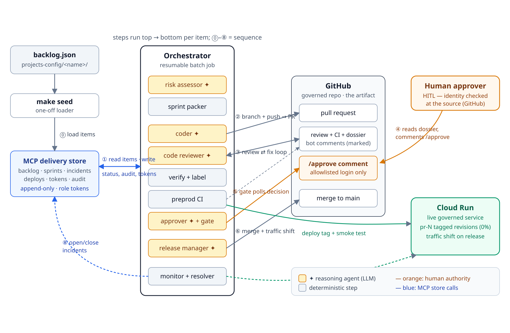
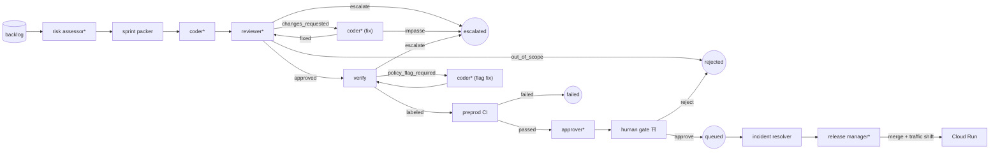

# Architecture

Agentic SDLC governs a fleet of coding agents the way an engineering
manager governs a team: it plans a sprint under a risk budget and a
token budget, verifies claimed risk against actual diffs, gates
approvals through humans, and makes incident-aware release decisions
against a live Cloud Run service.

Core design principle: **thin reasoning agents over a thick
deterministic substrate**. Every component is classified honestly as a
reasoning agent (an LLM decision loop over under-determined judgment)
or a deterministic tool (solver, script, threshold check). Agent labels
are earned by reasoning, not decoration.

## Interaction sequence

Numbered flow: ⓪ `make seed` loads `backlog.json` into the store · ①
the orchestrator reads items and writes status/audit/tokens back over
MCP · ② coder work becomes a PR · ③ the review⇄fix loop happens on
the PR · ④–⑤ the human reads the dossier and comments `/approve`,
which the gate reads on its next look (a native suspend; each event or nudge = one look) · ⑥ release manager merges + shifts traffic ·
⑦–⑧ the monitor probes the live service and opens/closes incidents in
the store.

## Pipeline

<!-- pipeline:begin (generated by scripts/render_pipeline.py) -->

```mermaid
flowchart LR
    backlog[(backlog)]
    backlog --> risk_assessor["risk assessor*"]
    risk_assessor --> sprint_packer["sprint packer"]
    sprint_packer --> coder
    coder["coder*"]
    code_reviewer["reviewer*"]
    coder --> code_reviewer
    verify["verify"]
    code_reviewer -->|approved| verify
    coder_fix["coder* (fix)"]
    code_reviewer -->|changes_requested| coder_fix
    rejected(("rejected"))
    code_reviewer -->|out_of_scope| rejected
    escalated(("escalated"))
    code_reviewer -->|escalate| escalated
    coder_fix -->|fixed| code_reviewer
    coder_fix -->|impasse| escalated
    preprod_ci["preprod CI"]
    verify -->|labeled| preprod_ci
    coder_flag_fix["coder* (flag fix)"]
    verify -->|policy_flag_required| coder_flag_fix
    verify -->|escalate| escalated
    coder_flag_fix --> verify
    approver["approver*"]
    preprod_ci -->|passed| approver
    failed(("failed"))
    preprod_ci -->|failed| failed
    approval_gate["human gate ⛩"]
    approver --> approval_gate
    queued(("queued"))
    approval_gate -->|approve| queued
    approval_gate -->|reject| rejected
    incident_resolver["incident resolver"]
    queued --> incident_resolver
    release_manager["release manager*"]
    incident_resolver --> release_manager
    release_manager -->|merge + traffic shift| prod["Cloud Run"]
```

`*` = reasoning agent; `⛩` = the human decides (on the PR); double circles are terminal store statuses. Everything else is deterministic.
<!-- pipeline:end -->

## Component classification

| Component | Kind | Why |
|---|---|---|
| Risk assessor | reasoning agent (Gemini) | risk/effort judgment is under-determined |
| Dependency graph | deterministic tool | import-graph closure = blast radius |
| Sprint packer | deterministic solver | constraint packing has a right answer |
| Coder | reasoning agent (Claude via LiteLLM) | writes code, owns the fix half of the generator-critic loop |
| Reviewer | reasoning agent (Gemini) | adequacy/scope judgment; different model family than coder to decorrelate failure modes |
| Verify + label | deterministic + thin check | files touched, closure, flag coverage vs claimed risk |
| Preprod CI | deterministic script | build, tagged revision, smoke test |
| Approver | thin reasoning agent + human gate | dossier assembly; decision is human, on the PR (ADR-0005) |
| Release manager | reasoning agent (Gemini) | weighs incidents, closures, confidence windows |
| Synthetic monitor | deterministic prober | threshold check on a sliding window |
| Incident resolver | deterministic tool | hysteresis rule; separate from detection by role |
| Orchestrator | Python driver (planning) + two ADK Workflows (per-item, release) | the per-item pipeline and the release pass each run as their own ADK graph — separate control loops with separate clocks; the driver owns planning and resume dispatch; release is event-driven over `status=queued` in the store, one pass per trigger (`python -m sdlc.app.release`) (ADR-0003, ADR-0007) |

## The one MCP boundary

The delivery store (`mcp_server/`) is the single shared boundary every
component crosses; it is the only MCP server (ADR-0002). Security
properties live in its tool surface: append-only audit, role-scoped
incident paths (per-caller bearer tokens).

## Knowledge architecture

Knowledge splits by owner (ADR-0001): design invariants (structural,
never injected) · step base prompts (`sdlc/steps/<step>/prompts.md`,
system-owned, open with immutable core rules) · step policy defaults
(`sdlc/steps/<step>/policy.yaml`; cross-step keys in
`sdlc/steps/policy.yaml`; pipeline flow control in
`sdlc/steps/orchestrator/policy.yaml`) · project overlays mirroring the
same hierarchy (`projects-config/<name>/steps/<step>/` —
customised-prompt.md extends prompts, policy.yaml overrides numbers) ·
ADRs (for humans, never injected).

Composition order at invocation:
**base prompts.md → customised-prompt.md → task payload.**

## Extensibility ports (one implementation each)

| Port | Implementation | Documented successor |
|---|---|---|
| AgentInvoker | ADKInvoker (owns all ADK wiring) | any framework; core never imports ADK |
| RepoHost | GitHub adapter | GitLab = one adapter + one config value |
| Scheduler | for-loop driver | Pub/Sub work queue |
| Sessions | ADK in-memory SessionService | ADK database/Vertex session service |
| Pipeline | list of step objects + SequentialDriver | durable driver (Temporal-style, ADK Workflow) |
| Store | SQLite behind MCP tools | Postgres behind the same tools |

Second implementations are documented, never built: scope caps are
verification budget, not typing budget.

The concrete successor for the Pipeline/Sessions ports is ADK-native, not
a fresh runtime: the per-item `Workflow` (already built for `adk web`)
becomes the executing path under an `App` with `ResumabilityConfig` and a
`DatabaseSessionService`, so ADK's graph engine supplies durable resume,
bounded retry, and the human-gate suspend/resume — replacing the
hand-rolled asyncio poll/sleep/semaphore loops. Release then moves to its
own event-triggered loop (Cloud Scheduler / webhook → Pub/Sub → ambient
trigger), per project. The store stays the governance/audit truth; ADK
sessions own execution state only. The far end of this path is projects
that supply their own pipeline definition and compose steps from an
off-the-shelf behavior catalog, with the G-series guarantees staying
engine-enforced rather than configurable.

## Framework boundary (ADR-0007)

The SDLC core is framework-agnostic: `sdlc/ports/agents.py` defines
the AgentInvoker port (AgentSpec in — prompt, model name, declared tool
needs — Invocation out), and `sdlc/steps/*/spec.py` DECLARE tools
(plain callables, or a `StoreTools` filter) rather than constructing
them. Three ports draw the boundary: `sdlc/ports/agents.py`
(AgentInvoker, agent turns) and `sdlc/ports/execution.py`
(PipelineExecutor, the per-item pipeline; ReleaseExecutor, the release
pass). Exactly one package speaks ADK: `adapters/adk/` materializes
specs into `LlmAgent`s (LiteLLM bridging, MCP toolsets, token metering
via `after_model_callback`, `output_schema` on the tool-less approver)
AND *executes* both control loops as native ADK 2 `Workflow`s — the
per-item pipeline (`workflow.py` builds the graph, `executor.py` runs
it; fix/flag loops are routed cycle edges, the human gate is a native
`RequestInput` suspend) and the release pass (`release_workflow.py`:
incident hygiene → store-queue walk as a routed cycle, one PR at a
time). Two composition roots choose the framework
(`sdlc/app/sprint.py` and `sdlc/app/release.py`), injecting
the ports each runs. `tests/test_framework_boundary.py` enforces the
boundary structurally (the core imports no framework);
`tests/test_item_workflow.py` and `tests/test_release_workflow.py` run
both graphs end-to-end on ADK's engine with handlers stubbed; structured
verdicts (`sdlc/governance/schemas.py`) validate every agent decision at
the boundary.

Dev loop: `make adk-web` (entries in `tests/debug/adk_web/`, one shared
bootstrap) serves each reasoning worker in `adk web` with exactly the
pipeline's prompt/model/tools; `evals/` carries the
risk-assessor dataset (Vertex eval schema) beside the deterministic
pipeline eval.
